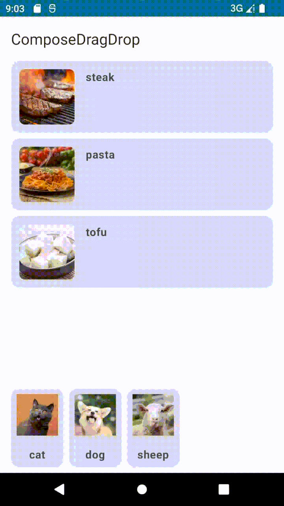

# ComposeDragDrop
Android Jetpack Compose DragDrop library

### Versions

[](https://search.maven.org/search?q=g:%22cn.tinyhai.compose%22%20AND%20a:%22dragdrop%22)


## Install
---
```kotlin
allprojects {
  repositories {
    //...
    mavenCentral()
  }
}
```

Add dependencies:

For kts
```kotlin
implementation("cn.tinyhai.compose:dragdrop:latest_version")
```
For groovy
```groovy
implementation 'cn.tinyhai.compose:dragdrop:latest_version'
```

## Demo
---


## Usage
---

Write a `DragDropBox` and put your content inside it
```kotlin
DragDropBox(
    modifier = Modifier.fillMaxSize(),
    scale = 1.2, // scale size of drag target
    alpha = 0.9, // alpha of drag target
) {
    // put your content here
}
```

Wrap your `@Composable` content that you want to make draggable with `DragTarget`
```kotlin
DragTarget<String>(
    dataToDrop = "dataToDrop",
) {
    // put your draggable content here
}
```

Wrap your `@Composable` content that you want to make droppable with `DropTarget`
```kotlin
DropTarget<String>(
    onDrop = {
        // this will be invoked when the data is dropped in this DropTarget
    },
) { isInBound, data ->
    // put your droppable content here
}
```

After all of above, make sure your content is structured as follows
```kotlin
DragDropBox {
    CustomComposable {
        // make sure both DragTarget and DropTarget are inside DragDropBox
        DragTarget<Any> {
            // draggable content
        }
        DropTarget<Any>(onDrop = {}) {
            // droppable content
        }
    }
}
```

For more details, you can clone this project and run it by yourself.

## Credits
---

- [Drag_and_drop_jetpack_compose](https://github.com/cp-radhika-s/Drag_and_drop_jetpack_compose) inspired and based